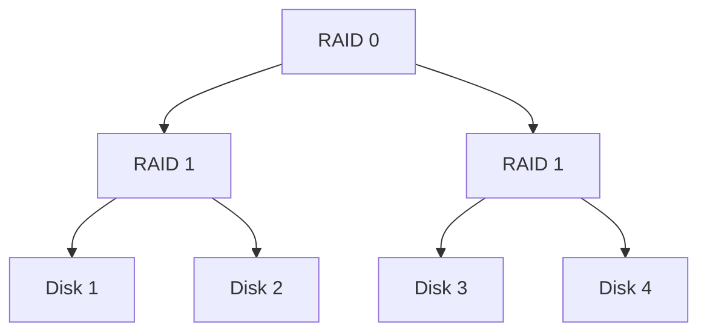

# 在 Linux 上使用 mdadm 创建软 RAID

前段时间升级了一下 NAS 设备，使用一块退役主机的 R5600 作为 CPU，购置了 4x4T 的 HDD 作为数据盘。这么大的硬盘容量，如果只是单纯插在主板上，然后用 /dev/sdX 去进行管理也太奇怪了。所以准备构建一套 RAID。

> 页面终于能用了，太好了，这篇文章早就写好了，终于可以发出来了。

## RAID 是什么
> **独立硬盘冗余阵列**（**RAID**, **R**edundant **A**rray of **I**ndependent **D**isks），旧称**廉价磁盘冗余阵列**（**R**edundant **A**rray of **I**nexpensive **D**isks），简称**磁盘阵列**。利用虚拟化存储技术把多个硬盘组合起来，成为一个或多个硬盘阵列组，目的为提升性能或资料冗余，或是两者同时提升。

### 标准 RAID 级别
以下讨论的是 Standard RAID Level，也就是标准RAID 级别。

RAID 有「级别」之分。不同级别的 RAID 需求的硬盘、容错能力、性能等都有所不同。具体可以见下表：
 ( n 表示有 n 块大小相同的硬盘。)

| RAID 级别 | 最小硬盘数 | 最大容错 | 可用容量 | 读取性能 | 写入性能 | 描述                                     |
| ------- | ----- | ---- | ---- | ---- | ---- | -------------------------------------- |
| 没有 RAID | 1     | 0    | n    | 1    | 1    | 一块硬盘，以及多块硬盘「拼接」起来                      |
| RAID 0  | 2     | 0    | 1    | n    | n    | 并联，数据均匀分布在多块硬盘上，最快，但是没有容错（一块坏掉，数据全坏）   |
| RAID 1  | 2     | n-1  | 1    | n    | 1    | 数据在每块盘上都有存储，安全性最高，没有写入速度的提升            |
| RAID 5  | 3     | 1    | n-1  | n-1  | n-1  | 奇偶校验，校验数据在所有磁盘上都有，一块磁盘坏了，可以根据其他数据进行重构。 |
| RAID 6  | 4     | 2    | n-2  | n-2  | n-2  | 两种不同的校验，可以允许两块硬盘失效。                    |

> **RAID2 - RAID4**?
> RAID2 通过海明码校验，需要4块数据盘，3块校验盘，受到阵列中最慢效率限制，没有实际用途。
> RAID3 Bit－interleaving（数据交错存储）技术，将相同比特检查后单独存在一个硬盘中，但由于数据内的比特分散在不同的硬盘上，因此就算要读取一小段数据资料都可能需要所有的硬盘进行工作，也没有什么实际作用
> RAID 4 采用块交织技术（Block interleaving），和 RAID 3 类似，只不过单位不是以 bit 而是以块。

### 组合 RAID

可以视为进行嵌套：
例如 RAID 10 和 RAID 01：
- RAID 10:

- RAID 01:

除此外还有 RAID 50，RAID 60 都类似以上。

### Linux MD RAID 10[^1]
Linux MD:
> md - Multiple Device driver aka Linux Software RAID

 Linux 中使用 **mdadm** 创建和管理软 RAID。

Linux MD RAID 10 的实现并不是标准的 RAID 10。[^2]
Linux 下的 RAID10 建立在 RAID1+0 的概念上，但它将其实现为单一的一层，这一层可以有多种不同的布局。

分为远近两种布局：
在 Y 块硬盘上的*近 X 布局*在不同硬盘上重复储存每个数据块 X 次，但不需要 Y 可以被 X 整除。数据块放在所镜像的磁盘上几乎相同的位置，这就是_近布局_名字的来源。它可以工作在任意数量的磁盘上，最少是 2 块。在 2 块硬盘上的近 2 布局相当于 RAID1，4 块硬盘上的近 2 布局相当于 RAID1+0。

[^1]: [Non-standard RAID levels - Wikipedia](https://en.wikipedia.org/wiki/Non-standard_RAID_levels#Linux_MD_RAID_10)
[^2]: [RAID - Arch Linux 中文维基](https://wiki.archlinuxcn.org/wiki/RAID)

## 选择 RAID 等级
组 RAID 在笔者看来无非三个目的：
1. 寻求更高效的读写速度：如果只是寻求更快的读写速度，可以考虑用 SSD
2. 寻求更大的存储容量：如果只是寻求更大的存储容量，可以不使用 RAID 而是直接使用多张硬盘
3. 寻求数据备份（容错性）：实际上只依赖 RAID 备份也不可靠，核心数据还是建议遵循 *3-2-1原则*

> **3-2-1原则**
>
> 3 个副本，2个不同备份介质，1个异地容灾备份

因此你可能并不需要 RAID。

### 我的选择: 远 2 布局的 RAID 10
选择 RAID 10, far 2 的原因有如下：
1. 有镜像，容错1个盘
2. 读写速度提高：读速度 n 倍，写速度 n /2
3. 空间利用 50 %
> 为什么没有选择 RAID 5？
>
> RAID 5 的空间利用率可以更高，但是有如下缺点：
> 1. 数据重建耗时长，资源消耗很高，可能需要 100% 负载运转数十小时。如果在这个时间内，又有一块硬盘坏掉，那么所有数据都无法重建
> 2. 读取效率没有 RAID 10 高（但是其实差距不大，盘越多差距越小）

我的最终方案是使用 4 块 4T 的西部数据红盘，构建远2布局的 RAID 10：最终能得到 8T 的有效空间。

## 步骤

1. **磁盘分区**： 使用 fdisk 分别对 `/dev/sdX` 进行修改：
	1. n 创建分区，减去末尾 100M （以便之后替换硬盘时对齐大小）
	2. t 修改分区格式为 `Linux RAID`
	3. w 保存
2. **构建 RAID**: 使用 mdadm 命令：`mdadm --create --verbose --level=10 --metadata=1.2 --chunk=512 --raid-devices=4 --layout=f2 /dev/md/MyRAID10Array /dev/sda1 /dev/sdb1 /dev/sdc1 /dev/sdd1`
3. 现在这个磁盘阵列会作为 /dev/mdX 作为一个 block device，可以使用 mkfs 构建文件系统，如果使用 ext4 可以通过调整参数优化读写性能，参考 [RAID - Arch Linux 中文维基](https://wiki.archlinuxcn.org/wiki/RAID)
4. 可以通过 `cat /proc/mdstat` 查看奇偶校验进度，可能需要几个小时，在此期间阵列已经可以使用了（降级模式）
5. 修改配置文件
	1. `mdadm --detail --scan >> /etc/mdadm.conf`
	2. `mdadm --assemble --scan`

至此，我们已经构建完成了磁盘阵列，等待奇偶校验结束后，磁盘可以被满血使用了。
