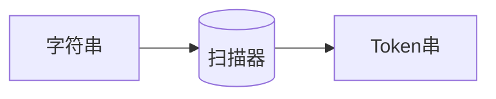

## 前言

编译原理是很有趣的一门学科，但是相对晦涩难懂。
本文的首要目的是为我自己梳理编译原理的学习笔记，也是为了能为后人有一个参考的资料。

本系列文章将会有若干篇，每篇文章的基本结构将会是：
1. 术语表：用于解释本文中的各种术语
2. 主要内容，将分为不同的几个标题
3. 技巧性的知识

## 术语表

本系列文章将在每篇的开头先把本文的术语解释一下。
在编译原理的学习过程中，各种奇怪的术语总是令人困扰。

- `Lexical Analysis` 将字符串转换为 Token 串的过程
- `Token` 词法单元, 通过词法分析得到的词法单元
-  `Regular Expression` 正则表达式、正规式：用来描述词法的工具
- `NFA`: Non-determined Finite Automaton，非确定有限状态自动机(详细解释见下文)
- `DFA`: Determined Finite Automaton, 确定有限状态自动机

## 词法分析的过程

词法分析的目的就是将一串字符串转化为计算机可以使用的串（也即 Token 串）。
执行这一过程的程序是一种 “扫描器”。按照一定方向（一般是从左到右）扫描字符串，并将得到的 Token 通过一定的方式表达出来 （例如 XML )

那么如何定义某个串为一个 Token 呢？ 这就需要用到正则表达式。
正则表达式是给人类使用的，用于定义 Token 串的工具，而计算机对于正则表达式也是束手无策。
实际上扫描器是基于有限状态自动机的。
## 正则表达式

本文不详细解释正则表达式，正则表达式理论上对于能够学习编译原理的同学并不陌生。
需要注意的是正则表达式有三种最重要的符号：

1. 联合，通常使用`+` 或 `|` 表示
2. 连接，通常不使用符号表示（或者使用 $\cdot$ 表示）
3. 闭包，通常使用`*` 表示

上述符号的优先级顺序为从上到下，优先级递增。
当然除此之外还需要括号来表示运算的优先级。
## 有限状态自动机

自动机是一种抽象的机器，形式化的描述是一个五元组

$$
M = (S, \Sigma, f, s_{0}, Z)
$$
其中
- $S$ 表示一个有限的状态集合
- $\Sigma$ 表示一个有限的符号集合
- $f$ 表示每个状态的一个转移函数
- $s_{0}$表示初始状态集
- $Z$ 表示终结状态集

说人话, 一个有限状态自动机的特点：
1. 有限个状态（而不是无限个），
2. 每个状态都可以通过转移函数转移到另一个状态。
3. 转移函数的输入是符号（字符）。
4. 当然也存在初始状态和终结状态（终结状态）

NFA 再进行限制，则是 DFA

DFA (确定性有限状态自动机) 的特点:
1. 一个状态的每个输入都只对应一个确定的状态（而不是一个输入可能对应两个状态）
2. 不存在空转移

需要注意的还有一点是 DFA 的状态数量可能是 NFA 状态的指数。
### FA 的表示法

可以通过状态转换图或状态转换表表达一个自动机。
对于人类来说，状态转换图或许是更直观的方式，

而对于计算机来说状态转换表或许是更合理的选择。

## 从正则表达式到自动机

从正则表达式转换到 NFA 是相对简单的。
只需要知道正则表达式的三个基本运算：连接、联合、闭包分别对应的NFA基本结构即可。

具体如下图所示

## 从 NFA 到 DFA

NFA存在空转移、每个状态的输入可能会导致多个不同的目标状态，因此对于计算机来说，使用 DFA 是更为合理的选择。
从 NFA 转换到 DFA 使用 **子集构造法**。

### 子集构造法

定义如下几个运算：

1. $\varepsilon-\text{closure}(s)$： 从 s 状态只通过 $\varepsilon$转换到达的状态集合
2. $\varepsilon-\text{closure}(T)$： 从 T 中的某个状态只通过 $\varepsilon$转换到达的状态集合（取并集）
3. $move(T,a)$：从 T 中某个状态通过 a 转换到达的状态集合

如果能通过空转移到达的状态，则视为等价，可以合并称为一个状态。
从等价状态集中的每个非等价状态通过 a 转换后得到的状态可以合并成一个新的状态。

从初始状态的等价状态集开始（记录为I），对每一种可能的转换
通过 a 转换后产生的新的状态（Ia）如果有新的状态，则加入第一列（I列）重复这个过程，直到没有新的状态产生。

参考 [编译技术：正规式、NFA、DFA、最简DFA的转换-CSDN博客](https://blog.csdn.net/jianbai_/article/details/106345056)
## DFA 的最简化

### 子集划分法

对于一个 DFA 进行状态的划分。
初始划分是终结状态和非终结状态。
对于每一个子集再进行划分：
其中的一部分都可以通过其他状态通过转换得到
而不能被得到的部分划分出来。
直到不能再划分。

参考：
[编译技术：正规式、NFA、DFA、最简DFA的转换-CSDN博客](https://blog.csdn.net/jianbai_/article/details/106345056)
